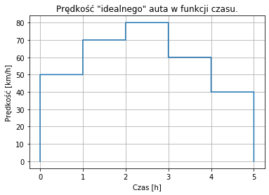
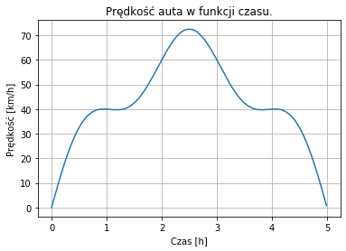

# Całki 

Gdy przyjdziesz w październiku na swoje wymarzone studia inżynierskie, możesz mieć złudzenia, że program będzie logicznie rozłożony. **To normalne.** Może Ci się wydawać, że całki zostaną wprowadzone na analizie matematycznej, a następnie wykorzystane na pozostałych przedmiotach inżynierskich.

## "Reality is often disappointing."

*In a perfect uczelnia, men like **dziekan** would not exist. But this is not a perfect uczelnia*. W rzeczywistości prowadzący na pierwszych zajęciach spyta Was, czy umiecie całkować, pomimo że od lat odpowiedź jest zawsze przecząca. W programie jego przedmiotu rachunek całkowy to tzw. prerequisite, więc będziesz zmuszony nauczyć się go z eTrapeza, żeby nie oblać. A gdy całki raczą się pojawić na analizie pół roku później (przy dobrych wiatrach), to już będzie musztarda po obiedzie. **I'm sorry, little one.**

**Chyba że** zdecydujesz się przeczytać ten artykulik do końca i poznasz **jeden prosty sposób** na zrozumienie całki. Poniżej zawarłem **potężne intuicje**, które pozwoliły mi zaliczyć wszystkie przedmioty inżynierskie z pierwszego roku oraz tzw. anala :~D *z latającymi kolorami*.

## Całek uczy się w gimnazjum.

Choć możesz sobie nie zdawać z tego sprawy, proste całki są Ci znane z gimnazjalnych lekcji fizyki. Exhibit A:  
*Samochód jedzie po prostej drodze z prędkością  przez czas .  
Jaką drogę przejedzie?*


```python
v = 80
t = 1
s = v * t
print(f"Samochód przejedzie drogę s = {s}km.")
```

    Samochód przejedzie drogę s = 80km.
    


Wykorzystaliśmy tu pewne uproszczenie. Założyliśmy stałą prędkość pojazdu, w którym to przypadku zachodzi równość:

<p align="center">  </p>

To nic innego niż szczególny przypadek całki. Prędkość to pochodna drogi po czasie, a zatem droga jest całką prędkości po czasie (kinda). Jeśli prędkość jest stałą rzeczywistą, to jej całką będzie funkcja liniowa dobrze znanej postaci:

<p align="center">  </p>

lub jak w tym przypadku:

<p align="center">  </p>

Ale zaraz, o co chodzi z ? Przecież liczyliśmy . Wprowadziłem nowe oznaczenie  dla *położenia* samochodu w układzie współrzędnych. Litera  oznacza w tym przypadku *drogę*, czyli różnicę położeń .

Znając prędkość i różnicę czasu byliśmy w stanie określić drogę, ale co możemy powiedzieć o położeniu? Znamy jego zmienność, więc możemy określić różnicę między jego wartościami dla różnych chwil w czasie (argumentów), nie możemy natomiast powiedzieć wiele na temat jego bezwzględnej wartości w danej chwili . Do naszego zagadnienia pasuje nieskończenie wiele par położeń. Mogą to być kilometry 1 oraz 81, 64 i 144 lub 361 i 441. Tak długo jak różnica między nimi wynosi 80, pasują do *rodziny* rozwiązań. To *important idea* w całkach.


```python
for i in range(100):
    for j in range(i,100):
        if (j**2 - i**2 == 80):
            print(j**2, i**2)
# Yeah I wanted to make the numbers pretty.
```

    81 1
    144 64
    441 361
    

## Do całki przez pochodną.

Mając daną funkcję , przez operację *różniczkowania* otrzymujemy jej pochodną  lub . Natomiast przez operację *całkowania* otrzymujemy jej funkcję pierwotną .

Zgodnie z definicją[[1]](#[1]):  

Funkcję  nazywamy pierwotną funkcji  na przedziale , jeżeli

<p align="center">  </p>

Czyli dla każdego  należącego do  wartość pochodnej funkcji  jest równa wartości funkcji .

A zatem w całkowaniu chodzi o znalezienie funkcji pierwotnych danej funkcji. **c00l beanz ;~D**, ale zanim zagłębimy się w całki, przypomnijmy sobie pochodne, bo w ten sposób możemy poznać **potężne intuicje**, które pozwolą na łatwe zrozumienie operacji całkowania i **zDeKlAsoWaNie pOzoStaŁyCh sTuDenTów nA ryNKu ParCy!!!!** 

<p align="center">  </p>

Powyżej znajduje się definicja pochodnej, czyli granica ilorazu różnicowego (to coś po prawej) w danym punkcie . Jest to stosunek przyrostu wartości funkcji do przyrostu wartości argumentu. Jeśli podzielimy przyrost funkcji przez przyrost argumentu otrzymamy stosunek - pochodną. A jeśli pomnożymy pochodną przez przyrost argumentu? ;-)

W liceum najczęściej używa się zapisu po lewej, z apostrofem. Na studiach w moim doświadczeniu wygodniejszy jest zapis środkowy, z  i . Przez długi czas nie wiedziałem, co on właściwie oznacza. Co reprezentuje ta literka ? Na analizie obiło mi się o uszy sformułowanie "operator", co wciąż było dla mnie dość enigmatyczne. Jednak gdy wreszcie doznałem olśnienia, zacząłem preferować tę postać, ponieważ wydaje mi się znacznie bardziej naturalna.

Stojąc samodzielnie  jest różniczką, czyli nieskończenie małym (eng.infinitesimal /ˌɪnfɪnɪˈtɛsɪm(ə)l/) przyrostem, długością jednego punktu na osi liczbowej. I gdy używana jest jako operator czegokolwiek (różniczkowania czy też całkowania), warto jest zachować tę intuicję.

Granica ilorazu różnicowego to w końcu nic innego, niż iloraz granic różnic (przyrostów). Nasze  w granicy to , a  staje się . Osobno są "równe" zero, ale ich iloraz się zachowuje i odzwierciedla nachylenie stycznej do wykresu funkcji, czyli prędkość zmiany wartości funkcji w danym punkcie.

### Przykład 1: model uproszczony

Powróćmy do analogii samochodu poruszającego się z prędkością  po jednowymiarowej drodze. Przyjmiemy pewien uproszczony przypadek, gdzie auto przyjmuje tylko dyskretne wartości prędkości, między którymi przechodzi natychmiastowo, z nieskończonym przyspieszeniem.

**Engineering Tip!**
1. Przy rozpatrywaniu różnych zagadnień warto używać najpierw uproszczonego modelu, aby uzyskać pewne intuicyjne zrozumienie problemu, a następnie stopniowo zwiększać jego złożoność przez bardziej wnikliwą analizę. Od ogółu do szczegółu. W pierwszym kroku powietrze nie istnieje, każdy płyn i gaz jest doskonały, a każda powierzchnia idealnie gładka.
2. Wartość dyskretna - wartość nieciągła, pojedyncza. Należąca do jakiegoś przeliczalnego (niekoniecznie policzalnego) zbioru, np. zbiór liczb całkowitych 


```python
import matplotlib.pyplot as plt
import numpy as np

x_0 = np.array([0, 1e-5, 1, 1+1e-5, 2, 2+1e-5, 3, 3+1e-5, 4, 4+1e-5, 5, 5+1e-5])
y_0 = np.array([0, 50, 50, 70, 70, 80, 80, 60, 60, 40, 40, 0])

fig, ax = plt.subplots()
ax.plot(x_0,y_0)

ax.set(xlabel='Czas [h]', ylabel='Prędkość [km/h]',
       title='Prędkość "idealnego" auta w funkcji czasu.')
ax.grid()

plt.show()
```





Nasze auto podróżuje z prędkością 50km/h przez pierwszą godzinę. Kolejną przebywa z prędkością 70km/h, 80 itd. Policzmy przebytą drogę, czyli różnicę między położeniem początkowym, a końcowym. To proste: jeśli auto przez godzinę jedzie z prędkością 50km/h, przejedzie 50km. Wystarczy posumować te odcinki czasowe i otrzymamy wynik.


```python
50 * (1 - 0) + 70 * (2 - 1) + 80 * (3 - 2) + 60 * (4 - 3) + 40 * (5 - 4)
```


    300


Otrzymany wynik to wynik całkowania funkcji prędkości po czasie. Choć operację tę rozumiemy dość intuicyujnie, kryje się w niej istota całkowania.

Dla każdego z tych godzinnych okresów prawdą jest, że:

<p align="center">  </p>
<p align="center">  </p>
<p align="center">  </p>

Czyli jeśli pomnożymy wartość pochodnej () przez ten przyrost argumentu (), otrzymamy przyrost wartości funkcji pierwotnej (). Całka to suma wszystkich tych przyrostów wartości funkcji pierwotnej.

#### Engineering Tip!
3. Poniższy symbol  to wielka grecka litera sigma, oznaczająca sumę. Dolny indeks przy symbolu oznacza zmienną, po której będziemy iterować w kierunku limitu zawartego w indeksie górnym.

<p align="center">  </p>

Jeszcze jedno: często mówi się o tym, że całka oznaczona równa jest polu pod wykresem funkcji. Właściwie czemu?  
Pole pod naszym wykresem możemy rozbić na 5 prostokątów. Wysokość każdego z nich to prędkość, a podstawa to różnica argumentów. Zatem chcąc zapisać wielkość tego pola, otrzymalibyśmy to samo równanie, co powyżej. *Easy peasy lemon squeezy.*

### Przykład 2: model rzeczywisty

Czas na bardziej realistyczny przykład. Tym razem nasz samochód będzie przyspieszał płynnie, ze skończonym przyspieszeniem i nieskończoną liczbą wartości prędkości. Na to wszyscy czekali, czas na big-boy całkę.


```python
x_1 = np.arange(0, 5, 0.01)
y_1 = 10*np.sin(np.pi*x_1) - 10*((x_1-2.5)**2) + 62.5
fig_1, ax_1 = plt.subplots()
ax_1.plot(x_1,y_1)
ax_1.set(xlabel='Czas [h]', ylabel='Prędkość [km/h]',
       title='Prędkość auta w funkcji czasu.')
ax_1.grid()
plt.show()
```





Przypomnijmy sobie pochodną. (Oznaczę równania gwiazdkami, popularna technika u wykładowców).

<p align="center">  </p>

Wzór ten wygląda bardzo podobnie do wzoru z przykładu 1, czyli:
<p align="center">  </p>

Bo wzór (\*\*) jest po prostu szczególnym przypadkiem wzoru (\*).

Przekształćmy (\*) tak samo, jak przekształciliśmy wcześniej (\*\*).
<p align="center">  </p>

A zatem różniczka  (nieskończenie mały przyrost ) jest równa iloczynowi wartości pochodnej  i różniczki  (nieskończenie małego przyrostu argumentu ). Do sumowania dyskretnych wartości z przykładu 1 użyliśmy symbolu sumy, greckiej wielkiej litery sigma . Do sumowania nieskończonej liczby nieskończenie małych przyrostów stosujemy symbol całki: 

> Wreszcie ten symbol. Behold its beauty: 

Tym razem równanie drogi zapiszemy jako:

<p align="center">  </p>

Zapis ten można interpretować na następujące sposoby:
- Pole pod wykresem funkcji ograniczone prostymi t=0 i t=5 (gdzie pole poniżej osi Ox liczy się jako ujemne),
- Różnica wartości wybranej funkcji pierwotnej dla t=5 oraz t=0 (praktyczny sposób liczenia całek oznaczonych),  
- **Suma przyrostów (dowolnej) funkcji pierowtnej od dolnej granicy całkowania (u nas t=0) do górnej (t=5) (fundamentalne znaczenie całki oznaczonej).**

Nasza funkcja opowiada nam historię zmiany jej funkcji pierwotnych.

## Całka nieoznaczona

*Z "Analiza Matematyczna 1"* [[1]](#[1]):

Niech  będzie pierwotną funkcji  na przedziale . Całką nieoznaczoną funkcji  na przedziale  nazywamy zbiór funkcji

<p align="center">  </p>

Całkę nieoznaczoną funkcji  oznaczamy przez .


Czyli całka nieoznaczona to zbiór funkcji pierwotnych danej funkcji. Najczęściej będziemy poszukiwać tej, której wyraz wolny  jest równy 0, ponieważ na takich najłatwiej się operuje, a są one równie dobrymi funkcjami pierwotnymi jak te z niezerowymi wyrazami wolnymi.

Całki nieoznaczone są ściśle związane z oznaczonymi, pozwalają mianowicie na ich łatwe policzenie. W przykładzie 1 dokładnie znaliśmy wszystkie dyskretne prędkości, więc problem policzenia całki był trywialny. Mając jednak do czynienia z funkcją ciągłą i niestałą nie mamy możliwości sumowania pól prostokątów, ponieważ mają nieskończenie małą szerokość i jest ich nieskończenie wiele. Wiemy natomiast, że zmienność funkcji pierwotnej jest dyktowana przez naszą funkcję prędkości. Znając funkcję pierwotną, wystarczyłoby wziąć jej wartość w punkcie startowym (czasie ) i odjąć ją od wartości w punkcie końcowym (czasie ). Całkowita zmiana wartości funkcji pierwotnej między tymi argumentami jest przecież właśnie naszą poszukiwaną sumą nieskończoności nieskończenie małych zmian! A jak odnaleźć funkcję pierwotną?

Należy zadać fundamentalne pytanie:  
**Pochodną jakiej funkcji jest moja funkcja?**

### Przykład 3: całka nieoznaczona wielomianu

 

  

Pochodna sumy to suma pochodnych, więc ta sama zasada aplikuje się do całek. Rozpatrzymy oba składniki osobno.
Najpierw . Jaka funkcja po różniczkowaniu da nam jednomian pierwszego stopnia? Jednomian drugiego stopnia oczywiście. To było jakoś tak, że potęga szła przed iksa i zmniejszała się o jeden. Więc odwrotnie będzie tak, że potęga zwiększy się o jeden i przed iksa pójdzie jej odwrotność. Zatem z  zrobi się , bo . Analogicznie, z  uzyskamy .

To powyżej to prawie prawda, bo przemilczany został jeden fakt. Mianowicie, że nie tylko pochodna  jest równa . Tak samo jest w przypadku ,  lub . To coś, co musimy wziąć pod uwagę. Wobec tego, ostateczne rozwiązanie będzie postaci:

<p align="center">  </p>

Przypomnij sobie *important idea* z gimnazjalnej całki. Droga zawsze była taka sama między dwoma punktami w czasie, ale pasujących par wartości położenia było nieskończenie wiele. Należy o tym pamiętać.

### A właściwie, to jakiej funkcji pochodną jest moja funkcja?

Pytanie stare jak świat (a raczej rachunek różniczkowy, który jest akurat stosunkowo młody, bo jego rozwój nastąpił dopiero w XVII wieku za sprawą dobrze znanego z fizyki Isaaca Newtona.[[2]](#[2])) Na szczęście wielu zdolnych matematyków zdążyło sobie je zadać, więc Ty (w przypadku prostych całek) nie musisz!

Poniżej znajduje się lista[[1]](#[1]) z najczęstszymi całkami.

-  dla 
-  dla  oraz 
-  dla 
-  dla  (liczby rzeczywiste bez całkowitych),  ustalany w zależności od parametru 
-  dla 
-  dla  oraz 
-  dla 
-  dla 

gdzie  oznacza stałą rzeczywistą.

## Podsumowanie

O całkach można mówić wiele. Jest to potężne narzędzie matematyczne, znajdujące zastosowanie w każdej gałęzi inżynierii i nie tylko. Liczę, że artykuł ten przybliżył Ci nieco koncept całki, pomógł wypracować pewne intuicyjne jej zrozumienie, zainspirował do nowego spojrzenia na barokowe piękno symbolu całki lub przynajmniej rozśmieszył papieżową liczbą.

*Signed: RibsonZ*

## Bibliografia

<a id="[1]">[1]</a> Marian Gewert, Zbigniew Skoczylas - "Analiza Matematyczna 1"

<a id="[2]">[2]</a> [Wikipedia: Isaac Newton](https://pl.wikipedia.org/wiki/Isaac_Newton)

<a id="[3]">[3]</a> [In a Perfect World](https://www.youtube.com/watch?v=Kl3H4vMqYNo)
