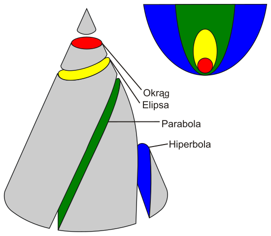
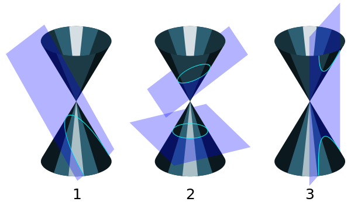
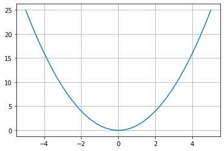
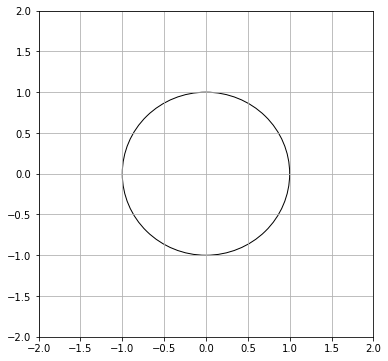
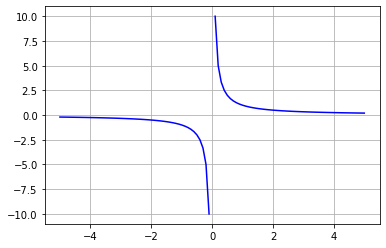
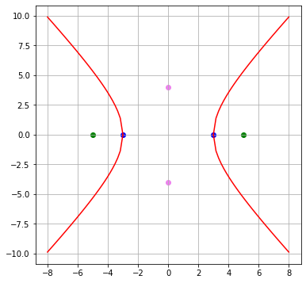
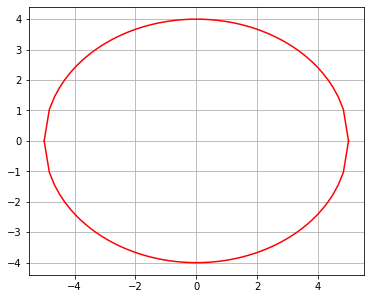

# Elipsy, Hiperbole, Parabole

Witaj w kolejnym matematycznym artykule na Inżynierskim Primerze. Dziś w menu temat, który wprawdzie **potęgą** nie dorównuje rachunkowi różniczkowemu, jest jednak przydatnym narzędziem do wizualizacji. Pozwoli Ci on nie tylko na łatwiejsze wyobrażenie wykresów niektórych funkcji, lecz także na *zmatematyzowanie* pewnych wykresów lub figur, czyli wyrażenie ich za pomocą równania; nie wspominając już o wrażeniu jakie zrobisz na studentkach/studentach z roku (tak na prawdę tylko na ćwiczeniowcu) swoją ponadprogramową płynnością w matematycznym żargonie!

Chcesz być najpopularniejszym (najbardziej znienawidzonym) freshmanem na wydziale? Chcesz, aby wszyscy podziwiali (kogo próbujesz oszukać) Twoją matematyczną wiedzę (more like random trivia tbh)? Czy chcesz uniknąć publicznego upokorzenia przez nauczyciela algebry? Jesteś w dobrym miejscu! Z tej strony ja, Twój @admin *RibsonZ*, a to "Elipsy, Hiperbole, Parabole"!

## Krzywe Stożkowe

Zestawienie krzywych w tym artykule nie jest przypadkowe. Są one wszystkie krzywymi stożkowymi. Krzywa stożkowa jest to zbiór punktów przecięcia płaszczyzny i powierzchni stożkowej. Poniższe grafiki ilustrują to pojęcie.  [[4]](#[5])[[5]](#[6])




## Szybki Recap

Zanim przejdziemy do nowych, ekscytujących rzeczy, wykorzystam Twój chwilowy dopaminowy boost koncentracji do przypomnienia pewnych podstaw. 

### Parabola

The oldest wykres in the book. Pierwsza kochanka. 
<p align="center">  </p>


```python
import matplotlib.pyplot as plt
import numpy as np

x = np.linspace(-5,5,50)
y = x**2

plt.plot(x,y)
plt.grid()
plt.show()
```





Parabola to ogólniej wykres funkcji kwadratowej . Choć jest ona dość powszechna, być może wciąż jestem w stanie Cię zaskoczyć. Otóż wszystkie parabole, podobnie jak kwadraty i koła, są podobne!

Podobieństwo dwóch figur zachodzi wtedy, gdy jedną z nich można otrzymać przez skalowanie (zmianę rozmiaru), translację (zmianę położenia), rotację (zmianę orientacji) lub odbicie drugiej. W przypadku kwadratów jest to dość oczywiste, parabole wymagają jednak chwili refleksji, przynajmniej dla mnie. Mylącym jest fakt, iż przeważnie widzimy tylko wycinek paraboli, podczas gdy w rzeczywistości jest ona nieskończona.

Jeśli zaś chodzi o czapki urodzinowe, parabola powstaje w wyniku przecięcia powierzchni stożkowej płaszczyzną, która tworzy z osią stożka taki sam kąt, jak tworząca stożka.

### Okrąg

Klasyczna figura. Jeden z największych wynalazków ludzkości.
<p align="center">  </p>


```python
from matplotlib.patches import Circle

circle = Circle((0,0), radius = 1, fill = False)
fig, ax = plt.subplots(figsize=(6,6))
ax.add_artist(circle)

ax.set_xlim((-2,2))
ax.set_ylim((-2,2))
plt.grid()

plt.show()
```





Równanie okręgu jest właściwie twierdzeniem Pitagorasa. W przestrzeni Euklidesowej odległość między dwoma punktami  to długość przeciwprostokątnej trójkąta prostokątnego skonstruowanego z odcinków równoległych do osi układu współrzędnych, rozciągniętych między odpowiadającymi współrzędnymi punktów. Słowem:

<p align="center">  </p>

Czyli po podniesieniu do kwadratu mamy:

<p align="center">  </p>


Przypiszmy  oraz . Wtedy ostatnie równanie przyjmuje postać:

<p align="center">  </p>

Zbiór punktów  spełniających to równanie to zbiór punktów równoodległych od punktu , czyli okrąg o środku w tym punkcie oraz promieniu . Aby uzyskać równanie powyżej wykresu, wystarczy przyjąć za  punkt .

Nawiązując ponownie do czapek, okrąg powstaje w wyniku przecięcia powierzchni stożkowej płaszczyzną prostopadłą do osi stożka.

## Hiperbola

Słowo pochodzi z greki: "ὑπερβολή" - "hyperbolḗ": „przerzucenie; przesada”. Fundamentem hiperboli są dwa wybrane punkty przestrzeni, zwane ogniskami. Hiperbolą nazywamy zbiór punktów płaszczyzny o równym module różnicy odległości od ognisk.

Jako krzywa stożkowa powstaje ona z przecięcia powierzchni stożkowej płaszczyzną nachyloną do osi pod kątem mniejszym niż tworząca. W wyniku tego przecina tę powierzchnię dwukrotnie, tworząc osobne ramiona.

A jak ona wygląda? O tak:


```python
x = np.linspace(1e-1, 5, 50)
y = 1/x

plt.plot(-x,-y, color='blue')
plt.plot(x,y, color='blue')
plt.grid()
plt.show()
```





To hiperbola znana nam od lat jako wykres funkcji 

<p align="center">  </p>

Ale istnieje również inne równanie hiperboli, mianowicie:

<p align="center">  </p>

Zajmiemy się jego wyprowadzeniem.


```python
# hiperbola o ogniskach (5,0) i (-5,0) oraz wierzchołkach (3,0) i (-3,0)
x = np.linspace(3, 8, 30)
y = np.sqrt((16/9)*(x**2)-16)
plt.figure(figsize=(6,6))
plt.grid()
plt.plot(-x,-y, color='red')
plt.plot(-x,y, color='red')
plt.plot(x,-y, color='red')
plt.plot(x,y, color='red')
plt.scatter([-5,5],[0,0], color='green')
plt.scatter([-3,3],[0,0], color='blue')
plt.scatter([0,0],[-4,4], color='violet')
plt.show()
```





W pierwszej kolejności zdefiniujmy jednak kilka kluczowych elementów hiperboli. Już poprzednio wspominaliśmy o ogniskach, które leżą u podstaw definicji naszej krzywej. Powtórzmy jednak dla ścisłości:
1. Ogniska - takie punkty płaszczyzny, że moduł różnicy odległości tych punktów od punktów hiperboli jest stały. Odległość między ogniskami określimy jako . (kolor zielony)
2. Wierzchołki - punkty należące do hiperboli, leżące na osi wyznaczonej przez jej ogniska; to także dwa leżące najbliżej siebie punkty pochodzące z przeciwnych ramion. Odległość między nimi zdefiniujmy jako . (kolor niebieski)
3. Wierzchołki urojone - punkty leżące na osi urojonej (symetralnej odcinka między ogniskami), leżące w odległości  od punktu przecięcia osi, gdzie . (kolor fioletowy)

Dobre wytłumaczenie elementów hiperboli można znaleźć na poniższej stronie internetowej. Zawiera ona również wyprowadzenie równania. Jest jednak anglojęzyczna.
https://courses.lumenlearning.com/collegealgebra2017/chapter/introduction-the-hyperbola/

Powiedzmy jeszcze parę słów o naszej hiperboli. Jej osie pokrywają się z osiami kartezjańskiego układu współrzędnych, jej ogniska leżą w punktach , jej wierzchołki zaś w punktach . W rezultacie jej wierzchołki urojone znajdą się w punktach 

**No to jazda.**

Definicja: moduł różnicy odległości od wierzchołków jest stały. Jaka to wartość? Taka sama dla wszystkich punktów, w tym wierzchołków. A jaka jest dla np. prawego wierzchołka?

<p align="center">  </p>

Zapisujemy tę definicję:

<p align="center">  </p>

Kwadrat obustronnie:

<p align="center">  </p>

Izoluję pierwiastek po jednej stronie równania, rozwijam kwadraty:

<p align="center">  </p>

Dzielę przez 2:

<p align="center">  </p>

Podnoszę do kwadratu:

<p align="center">  </p>

Wymnażam prawą stronę:

<p align="center">  </p>

Rozwijam prawą stronę w celu skrócenia:

<p align="center">  </p>

I skaracam:

<p align="center">  </p>

Izoluję  i :

<p align="center">  </p>

Podstawiam :

<p align="center">  </p>

<p align="center">  </p>

Dzielę obustronnie przez prawą stronę:

<p align="center">  </p>

<p align="center">  </p>

Eleganckie równanie eleganckiej krzywej.

## Elipsa

Gdy mowa o hiperboli, nie może zabraknąć także i elipsy. Jest ona rezultatem przecięcia powierzchni stożkowej oraz płaszczyzny nachylonej do osi stożka pod kątem większym niż kąt nachylenia tworzącej. Jej szczególnym przypadkiem jest okrąg.

Mikołaj Kopernik postulował, że planety poruszają się po okręgach. Johannes Kepler przyjrzał się orbitom nieco dokładniej i stwierdził, iż są one eliptyczne. Elipsa to zatem bardzo ważna krzywa.

Podobnie jak hiperbola, elipsa opiera się na dwóch punktach zwanych ogniskami. Jest ona zbiorem punktów, których **suma** odległości od ognisk jest równa pewnej stałej. Elipsa posiada (przynajmniej) dwie osie symetrii, (typowo) jedną dłuższą i jedną krótszą. Wzór elipsy o środku w punkcie , o "poziomej" osi długości  oraz o "pionowej" osi długości  przyjmuje postać:

<p align="center">  </p>

Wzór jest bardzo podobny do wzoru hiperboli, choć krzywe wyglądają kompletnie inaczej. Niemniej mają bardzo podobne elementy konstrukcyjne, takie jak ogniska czy wierzchołki. Wyprowadziłbym i ten wzór, ale perspektywa ponownego rozpisywania tych działań w LaTeX'u budzi we mnie odrazę. Zlecam więc to zadanie Tobie, w charakterze ćwiczenia ( tylko wyprowadzenie, nie rozpisanie go w LaTeX'u; tego nie życzyłbym nawet największemu wrogowi). 

Tak oto elipsa prezentuje się w matplotlibie:


```python
# elipsa o wierzchołkach w punktach (-5,0), (5,0), (0,-4), (0,4)
x = np.linspace(-5, 5, 60)
y = np.sqrt(-(16/25)*(x**2)+16)
plt.figure(figsize=(6,6))
plt.grid()
# plt.plot(-x,-y, color='red')
# plt.plot(-x,y, color='red')
plt.plot(x,-y, color='red')
plt.plot(x,y, color='red')
plt.gca().set_aspect('equal', adjustable='box')
plt.show()
```





Jako further reading dla płynnych w angielskim ponownie polecam materiały Lumen Learning:
https://courses.lumenlearning.com/collegealgebra2017/chapter/introduction-the-ellipse/

## Podsumowanie

Elipsy są wszędzie. Hiperbole też się zdarzają. Znałeś ich kształt, teraz znasz także ich analityczne równania i sowizdrzalskie powiązania ze stożkiem. Mam nadzieję, że dzięki temu artykułowi, gdy w czasie swej inżynierskiej przygody napatoczysz się na którąś z powyżej omówionych krzywych, na Twojej twarzy pojawi się cwaniacki uśmieszek mówiący: *haha, znam to.*

## Bibliografia

<a id="[1]">[1] </a>[Wikipedia: Krzywa stożkowa](https://pl.wikipedia.org/wiki/Krzywa_sto%C5%BCkowa)

<a id="[2]">[2] </a>[Lumen Learning Introduction: The Hyperbola](https://courses.lumenlearning.com/collegealgebra2017/chapter/introduction-the-hyperbola/)

<a id="[3]">[3] </a>[Wikipedia: Hyperbola](https://en.wikipedia.org/wiki/Hyperbola)

<a id="[4]">[4] </a>[Ilustracja: Conic sections with plane,](https://de.wikipedia.org/wiki/Datei:Conic_sections_with_plane.svg)
under [Creative-Commons License](https://creativecommons.org/licenses/by/3.0/deed.de)

<a id="[5]">[5] </a>[Ilustracja: Krzywe Stożkowe](https://commons.wikimedia.org/wiki/File:Krzywe_sto%C5%BCkowe.svg)

<a id="[6]">[6] </a>[Lumen Learning Introduction: The Ellipse](https://courses.lumenlearning.com/collegealgebra2017/chapter/introduction-the-ellipse/)
