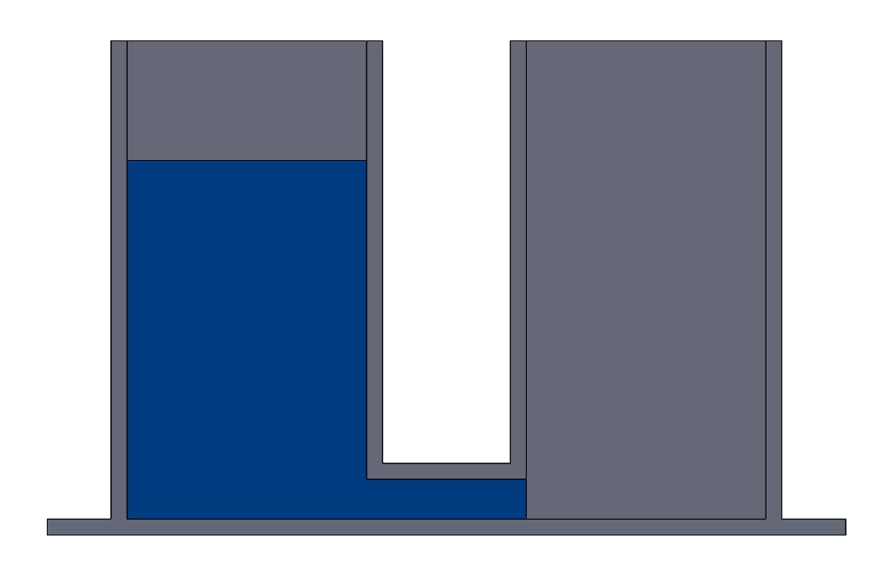

# Elektroniczne Elementy i Prawa

*Uwaga: ten artykuł zawiera elementy rachunku różniczkowego! Polecam wcześniej przeczytać mój materiał o całkach.*

Ten wpis spokojnie pominąć mogą wszyscy absolwenci techników o profilu elektronicznym, bo zapewne doskonale już znają jego temat i nic, co tu napiszę, ich nie zaskoczy. Natomiast jeżeli jesteś absolwentem liceum, a co gorsza liceum bez rozszerzonej fizyki, a planujesz pójść na kierunek związany choć w małym stopniu z elektroniką, ten artykuł to must-read!

Będzie prawo Ohma, będą rezystory, kondensatory, cewki i źródła, będzie napięciowe oraz prądowe prawo Kirchhoffa i oczywiście będzie zestawienie symboli elementów elektronicznych w standardzie IEC oraz ANSI/IEEE. Czakają Was *elektryzujące* wrażenia i akcja pełna *napięcia*! (ok, już przestaję.) Przed Wami: *Elektroniczne Elementy i Prawa*!

**DISCLAIMER:** Z tymi standardami symboli elektronicznych jest różnie. Niektóre publikacje uwzględniają różne style, niektóre wymagają jednego konkretnego. Umówmy się więc tak: mówiąc ANSI rozumiem styl z niżej wspomnianej książki "Fundamentals of Electric Circuits", mówiąc IEC mam na myśli styl z "Teorii obwodów elektrycznych" Bolkowskiego. Oba są reprezentatywnymi przykładami literatury naukowej, stosującymi poszczególne standardy.

## Spis Treści
1. [Obwodowa Biblia](#obwodowa-biblia)
2. [Fundamentalne Pojęcia](#fundamentalne-pojęcia)
3. [Prawo Ohma](#prawo-ohma)
4. [Elementy Elektroniczne](#elementy-elektroniczne)
5. [Prawa Kirchhoffa](#prawa-kirchhoffa)
6. [Podsumowanie](#podsumowanie)
7. [Bibliografia](#bibliografia)

## Obwodowa Biblia
Powiem to na samym początku, żeby nikt tego nie przegapił. W kwestii wprowadzenia do teorii obwodów z całego serca polecam książkę "Fundamentals of Electric Circuits" autorstwa Charles'a K. Alexander'a oraz Matthew N.O. Sadiku. To w mojej subiektywnej ocenie świetna pozycja, tłumacząca podstawy teorii obwodów w sposób logiczny, wyczerpujący, a przy tym bardzo przystępny. Przez całość pierwszego semestru stanowiła ona moją główną pomoc naukową w dziedzinie elektroniki i w dużej mierze to jej zawdzięczam odnalezienie się w tym obcym mi ówcześnie temacie. Do wyszukiwania wszelkiego rodzaju literatury naukowej polecam portal "academia.edu".

## Fundamentalne Pojęcia
Zacznijmy naszą podróż w świecie elektroniki od zdefiniowania podstawowych pojęć. Głupio by było mówić o prawach rządzących prądem, nie znając definicji prądu. Zatem...

### Prąd
> Prąd to ruch ładunków elektrycznych.

I tyle. Simple enough. Na ogół prąd porusza się w przewodnikach, którymi najczęsciej są metale, gdzie prąd porusza się za sprawą wolnych elektronów. Ich energia wiązania w atomie jest na tyle niska, że aż pomijalna - mogą poruszać się w strukturze krystalicznej przewodnika z bardzo niskim *oporem* (wrócimy do tego).

### Natężenie Prądu i Ładunek

Podstawową wielkością opisującą prąd jest *natężenie prądu*, zwane również po prostu *prądem*. Prąd mówi o szybkości przepływu ładunku, czyli o ilości ładunku przepływającego przez dany przekrój przewodnika w jednostce czasu. Jego jednostką jest amper [A] i jest to jedna z podstawowych jednostek układu SI. Zwyczajowo oznaczany jest literą  lub . Poniżej  oznacza ładunek (jednostka: kulomb [C]), a  - czas (jednostka: sekunda [s]).

  

A skąd się bierze *ładunek*? Ładunki są wszędzie, w każdym atomie, z którego składa się Twoje ciało. Tylko w Twoim ciele te ładunki się równoważą, zapewniając obojętność elektryczną. Jednak gdy atom ulega jonizacji, czyli rozdzieleniu ujemnie naładowanych elektronów od jąder zawierających dodatnio naładowane protony, ta obojętność zostaje zachwiana: powstają jony, czyli cząsteczki posiadające niezerowy ładunek elektryczny. Taki ładunek może być gromadzony i ulegać przepływowi.

*Istotna uwaga*: elektrony mają ładunek ujemny. Gdy mówimy o przepływie prądu, mówimy jednak o ruchu ładunku dodatniego. Oznacza to, że ruch prądu jest przeciwny do faktycznego ruchu nośników ładunku. Kiedyś uważałem to za jakąś głupotę, ale w sumie ma to sens. Rozważmy taki przypadek:  
W stalowej kulce A mamy ładunek -3C, a w kulce B: +3C. Przez łączący je przewodnik przepływa teraz od kulki A do kulki B liczba elektronów odpowiadająca ładunkowi -1C. Teraz kulka A ma ładunek -2C, a kulka B: +2C. Co się stało z perspektywy zewnętrznego obserwatora? Można powiedzieć zarówno, że ładunek +1C przepłynął z kulki B do kulki A, lub że ładunek -1C przepłynął z kulki A do kulki B. Oba stwierdzenia są prawdziwe. Po prostu nie możemy utożsamiać przepłwu ładunków z fizycznym ruchem elektronów.

### Napięcie
Napięcie to różnica potencjałów. Potencjał jest to natomiast poziom energetyczny. Jego jednostką jest wolt [V]. Przydatną analogią obrazującą pojęcie potencjału jest energia potencjalna grawitacji przy małych wysokościach. Możesz pamiętać z fizyki licealnej lub gimnazjalnej, że energia potencjalna wyraża się wzorem:

  

gdzie  to masa,  to przyspieszenie ziemskie, a  to wysokość. W tym przypadku masa będzie naszym ładunkiem, a wyrażenie  - potencjałem. Wyobraźmy sobie poniższy scenariusz:

Mamy dwa cylindry połączone przy dnie rurą. Jeden jest w pewnej części wypełniony - drugi pusty. Cząstki wody w lewym cylindrze są na pewnej wysokości nad dnem, a zatem na pewnym poziomie energetycznym - mają potencjał. Potencjał w prawym cylindrze wynosi zero.

Po chwili to się zmieni, gdyż woda zacznie przepływać z jednego cylindra do drugiego. W ten sposób cząstki wody znajdą sią na mniejszej wysokości, więc wartość ich potencjału  spadnie.
>Prąd, podobnie jak woda, płynie od wyższego potencjału do niższego.

Przepływ ten będzie następował tak długo, jak występować będzie różnica w potencjale między cylindrami. Gdy słupy wody będą równej wysokości, potencjały również będą równe, a zatem napięcie będzie wynosić zero.

**Podsumowując**, napięcie to różnica potencjałów, a jego obecność powoduje przepływ prądu w kierunku od wyższego potencjału do niższego.

### Moc

Znając pojęcia prądu i napięcia, możemy wprowadzić pojęcie mocy. Przy prądzie zmiennym kwestia nie jest całkiem prosta. Na szczęście przy prądzie stałym, którym zajmujemy się zawsze na początku, moc nie jest skomplikowanym zagadnieniem.

> Moc elektrycznego elementu to iloczyn jego napięcia i prądu.

  

Moc to szybkość wykonywania pracy. Ale gdzie w tym wzorze jakaś praca? Powyższa zależność może nie być oczywista na pierwszy rzut oka; wiem, że dla mnie nie była. *Let's unpack this.* Jednostka napięcia to wolt. Napięcie to różnica potencjałów, a potencjał to poziom energetyczny ładunku, czyli energia podzielona przez ładunek. Jednostką energii jest dżul [J], czyli  w jednostkach SI, a jednostką ładunku jest kulomb [C], czyli . Zapiszmy:

  

Pozostaje nam pomnożyć przez 1A.

  

Otrzymujemy wat, nie chce być inaczej. Spróbujmy też wziąć to na logikę: mamy napięcie, czyli zmianę poziomu eneregetycznego ładunków przez element; załóżmy, że ta zmiana jest na minus, czyli element zmniejsza potencjał ładunków. Mnożymy to przez prąd, czyli ilość ładunku w jednostce czasu. Mamy więc zmianę potencjału ładunku i ilość tego ładunku na jednostkę czasu. Zmiana potencjału razy ładunek to praca, a praca na jednostkę czasu to moc.

## Prawo Ohma

Pierwsze prawo, jakim się zajmiemy, jest to prawo Ohma. Dotyczy ono najprostszych elementów elektronicznych - rezystorów, czyli inaczej oproników. Oporniki to *dwójniki* (elementy z dwoma końcówkami), które stawiają opór (rezystancję) przepływowi elektryczności. Wracając do popularnej analogii przepływu wody, opornik jest jak zwężenie w rurze, które ogranicza przepływ cieczy. Prowadzi to także do spadku ciśnienia po zwężeniu, gdy wody będzie mniej, a rura znów się poszerzy.

Rezystancja danego kawałka przewodnika wyraża się wzorem:

  

gdzie  to długość rozpatrywanego fragmentu przeowdnika,  to pole jego przekroju poprzecznego, a  (mała grecka litera "ro") to rezystywność materiału, czyli taki współczynnik proporcjonalności charakterystyczny dla danego rodzaju przewodnika. Interpretacja tego prawa jest dość intuicyjna; elektrony muszą przedostać się przez sieć krystaliczną przewodnika. Ta zaś staje na drodze temu ruchowi, tworząc opór. Efektywna "*gęstość*" sieci krystalicznej wyrażana jest przez rezystywność . Teraz tak, im dłuższy jest element, tym dłuższa jest droga elektronu przez sieć, a co za tym idzie, rośnie rezystancja. A co z polem? Jeśli przy danym napięciu (siła, która porusza ładunki) przez jeden przewód przepłynie dany prąd, to przez 4 takie przewody przepłynie go 4 razy więcej. Jeśli pole przekroju jest 4 razy większe, to droga dla elektronów jest 4 razy szersza, a na każdą jednostkę długości przypada 4 razy więcej nośników ładunku. Logiczne jest zatem, że przepływ prądu będzie 4-krotnie łatwiejszy.

Znając pojęcie rezystancji możemy przejść do prawa Ohma. *Lo and behold:*

  

Choć ja wolę przekształconą formę:

  

Prawo Ohma mówi więc, że natężenie prądu w rezystorze jest wprost proporcjonalne do napięcia i odwrotnie proporcjonalne do oporu. Kolejna zależność o bardzo intuicyjnej interpretacji: im większa różnica potencjałów, tym silniej chce płynąć prąd. Im większy opór, tym mniejszy prąd popłynie. Wracając do analogii wody w rurze: im większa różnica ciśnień po obu stronach rury, tym więcej płynie wody, im cieńsza jest rura, tym mniej wody popłynie.

## Elementy Elektroniczne

Uzbrojeni w znajomość podstawowych pojęć w elektronice, możemy zrobić kolejny krok: budowa obwodu. Każdy obwód składa się z elementów elektronicznych oraz przewodów, które łączą poszczególne elementy. Dzielimy je na elementy bierne oraz elementy aktywne.

### Elementy Bierne

Elementy bierne to elementy, które **pobierają** energię z obwodu. Mogą ją magazynować lub rozpraszać.

Dla każdego z poniższych elementów przedstawię:
- krótki opis
- własność dominującą
- charakterystykę prądowo-napięciową (zależność prądu od napięcia na elemencie)
- energię zmagazynowaną w elemencie lub moc elementu (w zależności od roli w obwodzie)
- symbol IEC (Europa, polskie książki) oraz symbol ANSI (amerykański, znajdujący się w większości międzynarodowych publikacji)

#### Rezystor
Rezystor charakteryzuje się rezystancją. Gdy płynie przez niego prąd, odkłada się na nim pewne napięcie, określone wyżej omówionym prawem Ohma. Rezystor rozprasza odebraną energię w postaci ciepła z mocą podaną wzorem poniżej. Tradycyjny rezystor wykonany jest z rurki ceramicznej pokrytej warstwą węglową. Oczywiście istnieje wiele rodzajów rezystorów, także o innej budowie lub dodatkowej funkcjonalności jak np. regulowana rezystancja.
- własność: rezystancja 
- charakterystyka I-U: 
- moc: 

  

Powyżej symbol ANSI, poniżej IEC.

#### Kondensator
Kondensator posiada pojemność, czyli zdolność gromadzenia ładunku. Składa się z dwóch płytek (okładek) położonych blisko siebie, ale nie stykających się. Gdy do kondensatora wpływa prąd, ładunek odkłada się antysymetrycznie na jego okładkach (gdy na jednej odkłada się ładunek +Q, na drugiej odkłada się ładunek -Q); w ten sposób pojawia się między nimi napięcie. Wówczas między okładkami występuje również pole elektryczne. To właśnie w energii tego pola kondensator gromadzi zaabsorbowaną energię elektryczną. Pojemność to stosunek zgromadzonego ładunku  do napięcia na elemencie . Im większa pojemność, tym więcej ładunku potrafi zgromadzić kondensator przy danym napięciu. Inaczej: duży kondensator musi zjeść duuuużo ładunku zanim wzrośnie mu znacznie napięcie. W obwodach prądu stałego kondensator zastąpić można po prostu przerwą w obwodzie; pojemność nabiera znaczenia przy prądzie zmiennym, gdyż przeciwdziała zmianie napięcia, co wynika z charakterystyki I-U kondensatora (zmiana napięcia wywołuje przepływ prądu).
- własność: pojemność 
- charakterystyka I-U: 
- energia: 

  

Symbol kondensatora jest uniwersalny. Ciężko jest się temu dziwić; symbol ukazujący dwie okładki jest fantastycznie obrazowy i trudny do przebicia, choć gdzieniegdzie można spotkać symbol, gdzie jedna z okładek jest lekko wykrzywiona.

#### Cewka
Własnością cewki (inaczej zwojnicy) jest indukcyjność. Tradycyjna cewka składa się ze zwojów przewodu nawiniętych na ferromagnetyczny rdzeń: w najprostszej formie w kształcie walca, często również w kształcie toroidu. Gdy przez cewkę płynie prąd, powstaje w niej pole magnetyczne - cewka właściwie jest elektromagnesem. Tak jak kondensator w polu elektrycznym, cewka gromadzi energię w polu magnetycznym. Indukcyjność  to stosunek całkowitego strumienia magnetycznego  (wielka grecka litera phi [czyt. "fi"]) cewki do prądu  płynącego przez nią. Im większa indukcyjność, tym silniejsze pole produkuje cewka przy danym prądzie. W obwodach prądu stałego cewkę zastępuje się zwarciem, czyli po prostu połączeniem w obwodzie. Ciekawie robi się dopiero w odpowiedzi na sygnał zmienny, gdy cewka przeciwdziała zmianom prądu, wytwarzając napięcie: zgodnie z poniższą charakterystyką U-I. Tutaj łatwiej nam napisać zależność U-I zamiast I-U. Jak wynika z poniższego wzoru, zmiana prądu generuje napięcie.
- własność: indukcyjność 
- charakterystyka U-I: 
- energia:   

  

Powyżej ANSI, poniżej IEC. Symbol IEC jest również często spotykany z zaledwie trzema "garbami".

### Elementy Aktywne

Mamy elementy bierne, które pobierają energię z obwodu. Potrzebujemy teraz jakichś elementów, które tę energię będą dostarczać. Elementy te nazywamy aktywnymi. Opowiemy o dwóch teoretycznych źródłach energii.

#### Źródło Napięciowe
Źródło napięcia jak sama nazwa wskazuje wytwarza napięcie. Moc źródła determinuje się na podstawie analizy reszty obwodu: znamy oczywiście napięcie na elemencie, prąd musimy jednak obliczyć. Rzeczywistym odpowiednikiem źródła może być np. akumulator. Odnośnie literek: w konwencji ANSI źródła napięciowe oznacza się tak samo jak każde napięcie lub potencjał, czyli literą . Według konwencji IEC, źródła te oznacza się literą , napięcie na innych elementach literą , a potencjały literą . Poniżej symbole:

  

#### Źródło Prądowe
Źródło prądowe wymusza dane natężenie prądu. Tutaj z kolei napięcie jest nieznane, zatem do wyliczenia mocy potrzebna jest analiza reszty obwodu. Źródła prądowe najczęściej występują w zastępstwie jakiejś części obwodu, ciężko bowiem w rzeczywistości uzyskać stały strumień elektronów, niezależny od reszty obwodu. Oznacznie ANSI: , IEC: . Poniżej symbole:

  

Pewnie zauważyłeś/aś, że symbol IEC źródła napięciowego i ANSI źródła prądowego jest taki sam. W praktyce nie jest to duży problem, bo przy symbolu zawsze stoi odpowiednie oznaczenie lub wartość z odpowiednią jednostką.

## Prawa Kirchhoffa

Gustav Kirchhoff [1824-1887] był niemieckim fizykiem, który zapewnił sobie miejsce w historii elektroniki nazywając swoim nazwiskiem dwa fundamentalne prawa teorii obwodów: prądowe oraz napięciowe prawo Kirchhoffa. Zanim do nich przejdziemy, musimy omówić kilka formalności związanych z budową obwodów. Poniższy schemant posłuży nam za przykład:

  

Mamy tutaj wszystkie omówione wyżej elementy. Zastosowałem konwencję IEC dla elementów biernych oraz ANSI dla elementów aktywnych, bo taki zestaw symboli ma program, którego użyłem do wygenerowania tego schematu.

Wprowadźmy dwa przydatne pojęcia: węzeł i oczko.[[1]](#1) **Węzeł** to połączenie gałęzi, część przewodu nieprzedzielona żadnymi elementami. Ponieważ wewnątrz węzła nie ma żadnych elementów pozwalających na zmianę potencjału, cały węzeł ma ten sam potencjał. **Oczko** to dowolna zamknięta ścieżka w obwodzie. Może zawierać wiele węzłów i elementów; ważne, aby zaczynała się w tym samym miejscu, w którym się kończy.

Dla każdego z elementów na powyższym schemacie oznaczyłem prąd przy pomocy strzałki umieszczonej na gałęzi odchodzącej od elementu oraz napięcie przy pomocy strzałki idącej obok elementu. Strzałka prądu wskazuje referencyjny kierunek przepływu prądu, a strzałka napięcia wskazuje referencyjny wzrost potencjału. Mam przez to na myśli, że jeśli np. I_E będzie miało wartość dodatnią, to znaczy, że prąd płynie z dołu na górę, zgodnie ze wskazaniem strzałki. Jeśli otrzymamy ujemne I_E, oznaczać to będzie, że prąd płynie z góry na dół w tej gałęzi, przeciwnie do wskazania strzałki. Strzałka napięcia prowadzi od potencjału "przed" elementem do potencjału "po" elemencie: napięcie to różnica potencjału "po" i "przed". Czyli jeśli np. U_R1 będzie dodatnie, to znaczy, że potencjał na węźle nad rezystorem R1 jest wyższy niż potencjał na węźle poniżej o U_R1. Jeśli zaś U_R1 będzie ujemne, to ma miejsce sytuacja odwrotna: potencjał "po" elemencie będzie niższy niż potencjał "przed".

Teraz chcę zwrócić Twoją uwagę na sposób zaznaczenia strzałek. Zauważ, że wszystkie elementy aktywne mają strzałki prądów oraz napięć o tym samym zwrocie, a bierne o zwrocie przeciwnym. Taka jest konwencja i ma ona swoje logiczne uzasadnienie. Jak zapewne pamiętasz, elementy bierne odbierają energię z obwodu. Wprowadzę nowe pojęcie: bilans mocy. Bilans mocy w obwodzie to zestawiene sumy mocy elementów aktywnych oraz sumy mocy elementów biernych. Sumy te muszą oczywiście być równe: energia nie może pojawiać się znikąd lub znikać. Popatrzmy na rezystor R1 w naszym obwodzie. Jest on elementem biernym, który rozprasza energię. Załóżmy, że I_R1 jest dodatnie. Wtedy U_R1 także jest dodatnie, gdyż w rezystorze prąd wpływa z jednej strony, traci energię przemierzając gęstą sieć krystaliczną, a następnie wypływa z drugiej ze zmniejszoną energią, zatem na niższym potencjale. Pomnożenie I_R1 oraz U_R1 da nam moc P_R1, czyli szybkość rozpraszania energii przez rezystor. A gdybyśmy oznakowali U_R1 przeciwnie, czyli tak, jak znakuje się źródło? Nasza moc byłaby taka sama co do wartości, ale ujemna. Rezystor potraktowany jako źródło ma ujemną moc. To ma sens, gdyż w przeciwieństwie do źródła, rozprasza energię! Jendak zamiast mówić o ujemnej mocy, postanowiono zastosować odwrotne strzałki dla elementów biernych i zgodne dla źródeł. Wtedy dodatnia moc elementu oznacza, że spełnia on swoją rolę: bierny *odbiera* energię z obwodu, aktywny *dostarcza*. To naturalne rozwiązanie.

Jeszcze jedno: musimy znać rodzaje połączeń elementów. Dzielą się one na szeregowe i równoległe.
1. Połączenie szeregowe to takie, gdzie prąd wypływa z jednego elementu i wpływa do drugiego. Inaczej, elementy są połączone szeregowo, gdy dzielą ze sobą na wyłączność tylko jeden węzeł. W rezultacie przez oba elementy przepływa ten sam prąd. Przykładem połączenia szeregowego na powyższym schemacie jest połączenie cewki L1 i źródła prądowego J.
2. Połączenie równoległe to takie, gdzie elementy mają oba węzły wspólne. Przypomnij sobie, że węzeł ma swój ustalony potencjał. Elementy połączone równolegle zmuszone są mieć to samo napięcie (co do wartości). Na naszym schemacie równolegle połączone są źródło napięcia E, rezystory R1 i R2 oraz kondensator C1.

Omówiwszy zasady gry, możemy przejść do praw Kirchhoffa.

### Prądowe Prawo Kirchhoffa

Najpierw omówimy prądowe prawo Kirchhoffa, czyli tak zwane PPK, gdyż jest ono I prawem Kirchhoffa.
> PPK mówi, że z danej części obwodu musi wypływać tyle same prądu, ile wpływa.

Istnieją naturalnie bardziej formalne sformułowania tego prawa, ale nie wnoszą wiele do naszego zrozumienia. Wikipedia [[4]](#4) mówi, że "Suma natężeń prądów wpływających do węzła jest równa sumie natężeń prądów wypływających z tego węzła." Według Obwodowej Biblii [[1]](#1) algebraiczna suma prądów wpływających do węzła jest równa zero. (algebraiczna suma znaczy, że jeśli prąd wpływa to jest dodawany, jeśli zaś wypływa - odejmowany). Moja definicja jest uogólnieniem, zresztą równie intuicyjnym. Prawo to właściwie sprowadza się do stwierdzenia, że prąd nie bierze się znikąd i nie znika. Podobnie zresztą jak energia. Poniżej schemat, który posłuży nam za przykład.

  

Spójrzmy na połączenie, kropkę nad rezystorem R1. Przyjmiemy ją za naszą wybraną część obwodu i zastosujemy **PPK.** Widzimy, że do naszej kropki *wpływa* J, ponieważ strzałka jest skierowana w stronę kropki. Widzimy również, że z kropki *wypływa* I1 oraz I_R1. Możemy więc zapisać:

  

Dla innej kropki możemy też napisać:

  

Ale weźmy jeden krok w tył i spójrzmy na ten obwód. Widzimy 4 kropki łączące gałęzie; moglibyśmy wyciągnąć wniosek, że wobec tego istnieją cztery węzły. Ci lepiej wyspani lub świeżo po kawie/Monsterku zauważą, że to mylny wniosek. Tak jak wcześniej powiedziałem, węzeł to część przewodu nieprzedzielona elementami. Widzimy, że zgodnie z tą definicją nasz obwód posiada tylko 2 węzły. Mamy do czynienia z czterema elementami połączonymi równolegle. Właściwie możemy zapisać tylko jedno sensowne PPK, obowiązujące dla obu węzłów:

  

Prąd I1 to pacynka i w rzeczywistej realizacji obwodu lub w równoznacznym przerysowaniu mógłby równie dobrze nie istnieć, ponieważ jest wewnątrz węzła, tj. nie prowadzi bezpośrednio do żadnego elementu.

### Napięciowe Prawo Kirchhoffa

Skoro było I prawo Kirchhoffa, musi być i drugie. Jak zapewne się domyślasz, skrótowo będziemy je nazywać NPK. Mówi ono, że...
>Algebraiczna suma napięć wokół oczka jest równa zero.

Co to znaczy? Spójrzmy na przykładowy schemat.

  

Nasz obwód ma jedno oczko - jedną możliwą zamkniętą trasę wokół obwodu. Na oczku tym zasosujemy NPK. Literą 'A' zaznaczyłem na schemacie dowolnie wybrany węzeł. Teraz będziemy zgodnie ze wskazówkami zegara iść po oczku, sumując wszystkie napięcia algebraicznie, aż dojdziemy z powrotem do węzła A. Najpierw na drodze napotykamy źródło E. Dajemy więc do sumy "+E". Potem mamy U_R1 skierowane przeciwnie do kierunku naszej podróży, więc odejmujemy je, uzyskując "E - U_R1". Podobnie z U_R2 i U_R3. Ostatecznie uzyskujemy "E - U_R1 - U_R2 - U_R3". NPK mówi, że ta suma musi być równa zero. Zatem:

  

NPK również nie jest zbyt odkrywczym prawem; jeśli jeszcze tak nie uważasz, spróbuję Cię przekonać. Napięcia to różnice w potencjałach węzłów. Zaczynamy z jakiegoś potencjału V_A w naszym węźle A. Za źródłem znajduje się węzeł, gdzie potencjał jest wyższy o E. Potem napotykamy rezystor, za którym potencjał wynosi V_A + E - U_R1. Następnie napotykamy spadek o kolejno U_R2 i U_R3. Powróciliśmy w ten sposób z powrotem do punktu A, gdzie potencjał wynosi V_A. Mamy wobec tego:

  

Odejmijmy obustronnie nasz potencjał odniesienia V_A i otrzymamy oryginalne równanie. NPK mówi wyłącznie o tym, że napięcia w obwodzie muszą przestrzegać praw logiki. Postaram się to naświetlić kolejnym przykładem.

Karol jest fanem trekkingu i kocha szlaki górskie. Tym razem postanowił zdobyć Jarząbczy Wierch (2137m n.p.m.) Parkuje swoje auto na parkingu na wysokości 1337m n.p.m. Do szczytu musi zatem pokonać 800m pionowo w górę. Na szlaku napotyka wiele podejść i kilka zejść w dół, jednak wypadkowa wysokość, jaką pokonuje, wynosi 800m. Żądny przygód Karol postanawia zejść ze szczytu z powrotem do auta innym szlakiem. Ten posiada liczne zejścia i kilka podejść w górę, choć są one zupełnie innej wysokości niż przy poprzednim szlaku. Gdy Karol po długiej wyprawie wreszcie powraca do swojego samochodu, ponownie pokonuje wypadkową wysokość 800m w dół, ponieważ znów znalazł się na poziomie 1337m n.p.m., gdzie zaparkował swoje auto. Oznacza to, że algebraiczna suma wzniesień i spadów terenu, jakie pokonał, wynosi zero.

W naszych obwodach Karol to prąd, wysokość to potencjał, a wzniesienia i spadki terenu to napięcia na elementach elektronicznych. Idąc przez obwód po oczku musimy powrócić do tego samego potencjału, z którego wyruszyliśmy.

## Podsumowanie

Elektronika to piękna dziedzina inżynierii, w której rządy sprawują prawa fizyki i logiki. Mam nadzieję, że zdołałem Ci ją przedstawić w pozytywnym świetle oraz że odchodzisz od tego artykułu z poszerzonym jej zrozumieniem. Po tej lekturze będziesz lepiej przygotowany na wyzwania, jakie rzuci Ci Twój pierwszy kurs teorii obwodów i docenisz go w większym stopniu, najzwyczajniej rozumiejąc więcej. Dzięki serdeczne za poświęcony czas i zapraszam do dalszych poświęceń na rzecz pozostałych artykułów z Inżynierskiego Primera.

*Signed: RibsonZ*

## Bibliografia

<a id="1">1.</a> Fundamentals of Electric Circuits - Charles K. Alexander, Matthew N. O. Sadiku

<a id="2">2.</a> [Graphic Symbols for Electrical and Electronics Diagrams](https://www.ee.iitb.ac.in/~spilab/Tips/ansii_graphic_symbols_for_electrical_and_electronics_daigrams_1993.pdf)

<a id="3">3.</a> [Volatage source - Wikipedia](https://en.wikipedia.org/wiki/Voltage_source)

<a id="4">4.</a>  [Pierwsze prawo Kirchhoffa - Wikipedia](https://pl.wikipedia.org/wiki/Pierwsze_prawo_Kirchhoffa)
